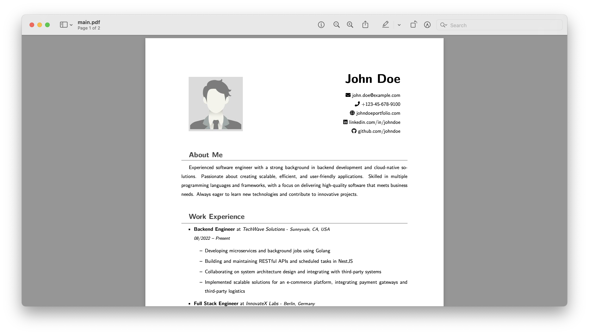

# Dead Simple Resume

<p align="center">
  
</p>

A straightforward LaTeX resume template. Simply edit the values in main.tex and compile to create the PDF.

## Pre-requisites to run this project

- Install xelatex for your OS from [here](http://www.texts.io/download/)
- (optional) Install ghostscript for your OS from [here](https://ghostscript.com/releases/gsdnld.html)

## Steps to run this project

1. Update the values in main.tex file
2. Update the pdf metadata in metadata.ps
3. Run the command to generate a pdf "main.pdf"
    ```shell
    xelatex -shell-escape main.tex
    ```
4. Pass the pdf through ghostscript to make it compliant.
    ```shell
    gs -sDEVICE=pdfwrite -dCompatibilityLevel=1.4 -dPDFSETTINGS=/default -dNOPAUSE -dQUIET -dBATCH -sOutputFile=my_resume.pdf metadata.ps main.pdf 
    ```
5. "resume.pdf" file is generated

### Tech stack

- Latex


## Contact

mohdejazsiddiqui@gmail.com

[](https://ko-fi.com/Y8Y618ZETK)